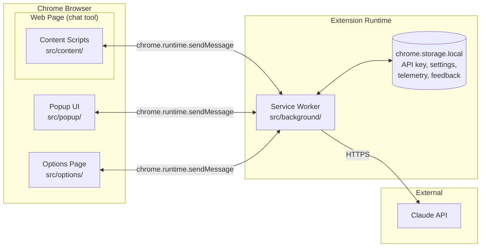
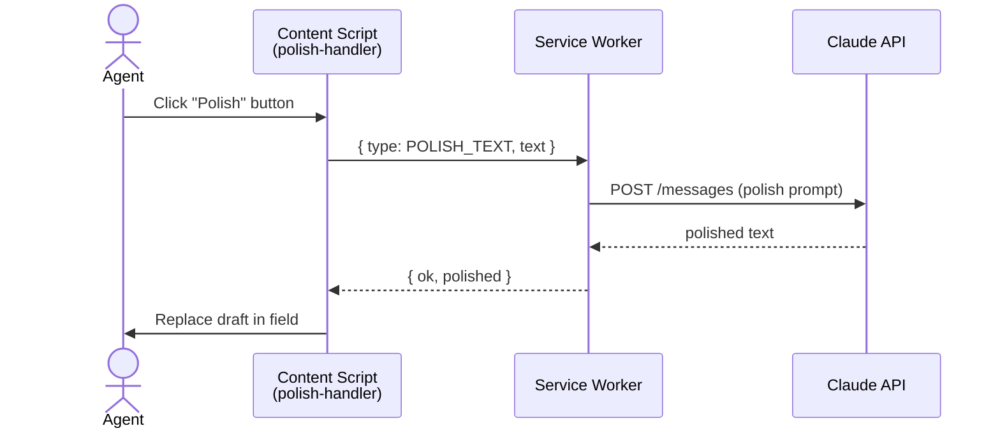
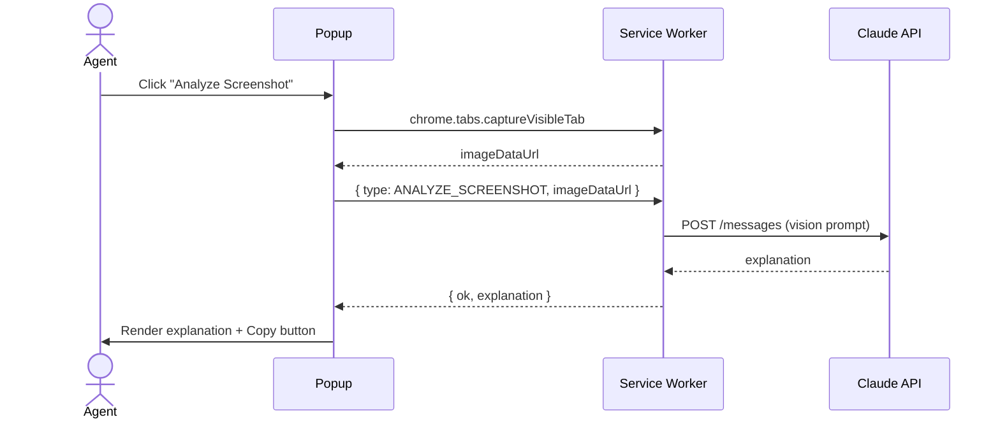
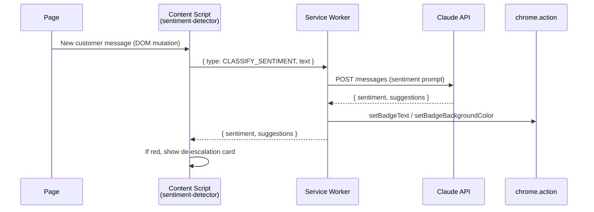
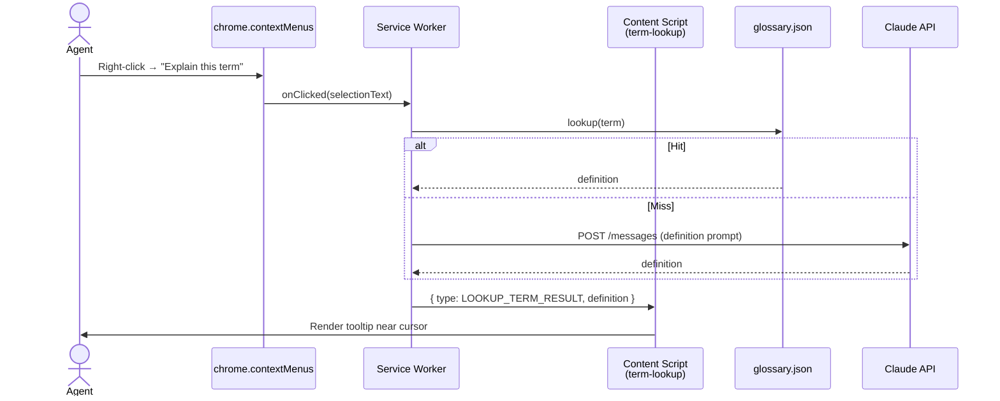
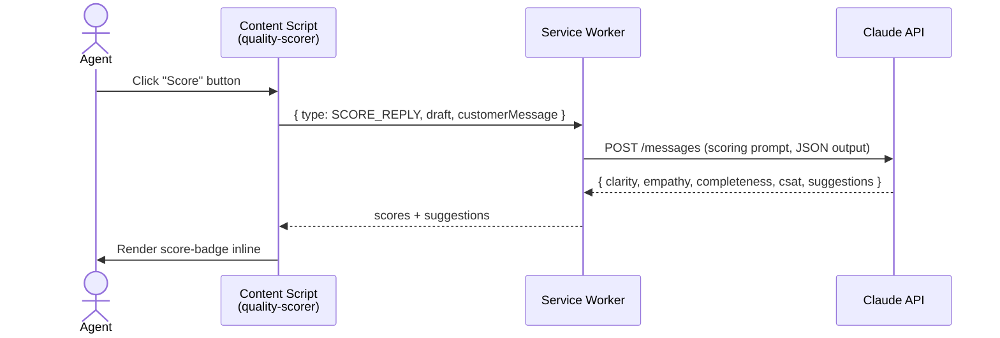

# Insystem — Chrome Extension Architecture

Technical architecture for the Insystem Chrome Extension. Read [`CLAUDE.md`](../CLAUDE.md) for the project overview, tech stack, and coding conventions.

---

## 1. Component Diagram



**Key principle:** the **service worker is the only component that talks to the Claude API**. Content scripts, popup, and options page never touch the API directly — they message the service worker.

---

## 2. Directory Structure

```
src/
  content/
    index.ts                # Entry point, initializes all content modules
    text-detector.ts        # Detects active text fields
    floating-toolbar.ts     # Injects Polish/Score buttons near fields
    polish-handler.ts       # F1 logic
    sentiment-detector.ts   # F3 message monitoring
    term-lookup.ts          # F4 selection handling
    quality-scorer.ts       # F5 logic
    tooltip.ts              # Shared tooltip component (shadow DOM)
    score-badge.ts          # F5 inline score display
  popup/
    index.html              # Popup shell
    index.ts                # Popup controller
    screenshot-capture.ts   # F2 capture
    screenshot-analyzer.ts  # F2 analysis display
    crop-tool.ts            # F2 optional crop
    sentiment-dashboard.ts  # F3 dashboard
  background/
    index.ts                # Service worker entry
    message-handler.ts      # Routes messages from content / popup
    badge-manager.ts        # F3 icon badge updates
    context-menu.ts         # F4 right-click menu
  shared/
    api-client.ts           # Claude API client
    types.ts                # All TypeScript interfaces
    glossary.json           # F4 betting terms (30+)
    telemetry.ts            # Usage tracking
    feedback.ts             # Response ratings
    constants.ts            # Shared constants
  options/
    index.html              # Options page
    index.ts                # API key management, feature toggles
tests/                      # Vitest unit + integration tests
docs/                       # Project documentation
public/                     # manifest.json, icons
```

---

## 3. Message Passing

All cross-context communication uses Chrome's message-passing APIs.

| From | To | API |
| --- | --- | --- |
| Content script | Service worker | `chrome.runtime.sendMessage()` |
| Service worker | Content script | `chrome.tabs.sendMessage(tabId, …)` |
| Popup | Service worker | `chrome.runtime.sendMessage()` |
| Options | Service worker | `chrome.runtime.sendMessage()` |

### Message types

Defined in `src/shared/types.ts` as a discriminated union:

```ts
type Message =
  | { type: "POLISH_TEXT"; text: string }
  | { type: "ANALYZE_SCREENSHOT"; imageDataUrl: string }
  | { type: "CLASSIFY_SENTIMENT"; text: string }
  | { type: "LOOKUP_TERM"; term: string }
  | { type: "SCORE_REPLY"; draft: string; customerMessage?: string };
```

The service worker's `message-handler.ts` is a single switch over `message.type` that dispatches to the right handler and returns a typed response.

---

## 4. Data Flow per Feature

### F1 — Text Polish



### F2 — Screenshot Analyzer



### F3 — Sentiment Alert



### F4 — Quick Term Lookup



### F5 — Response Quality Scorer



---

## 5. Chrome Permissions

Declared in `public/manifest.json`. Each permission has a clear justification:

| Permission | Why |
| --- | --- |
| `activeTab` | Capture screenshots of the active tab (F2) and inject content scripts on demand. |
| `storage` | Store the API key, feature toggles, telemetry counters, and feedback ratings in `chrome.storage.local`. |
| `contextMenus` | Register the "Explain this term" right-click entry for F4. |
| `tabs` | Required by `chrome.tabs.captureVisibleTab` for F2 screenshot capture. |

No `<all_urls>` host permission in v1 — content scripts are scoped to known chat-tool domains in the manifest.

---

## 6. Security Considerations

- **API key isolation.** The Claude API key is read from `chrome.storage.local` **only inside the service worker**. It is never sent to content scripts, never injected into the page, and never logged.
- **All API traffic goes through the service worker.** Content scripts and the popup cannot make direct calls to `api.anthropic.com`. This keeps secrets out of the page context and gives us a single place to add rate limiting, retries, and telemetry.
- **Shadow DOM for UI isolation.** All injected UI (floating toolbar, tooltip, score badge, de-escalation card) is rendered inside a shadow root attached to a host element. This prevents page CSS from leaking in and prevents page scripts from reading our DOM.
- **Input sanitization.** All text from the page (drafts, customer messages, selections) is treated as untrusted: trimmed, length-capped, and never `innerHTML`'d. UI rendering uses `textContent`.
- **No third-party telemetry.** Telemetry is local-only (`chrome.storage.local`), never sent off-device in v1.
- **Strict CSP.** The extension's content security policy disallows remote scripts and `eval` (Manifest V3 default).
- **Least-privilege host matches.** Content scripts are matched only to the explicit list of supported chat-tool domains, not `<all_urls>`.
