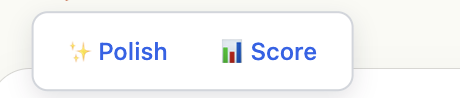
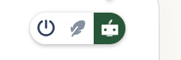

# Implementation Recommendation Plan

## Overview

Improve the AI features (Polish, Score) UI/UX in the reply area to make it less distracting and more intuitive.

---

## Problem

The current implementation displays the **✨ Polish** and **📊 Score** buttons directly inline near the reply input area as labeled text buttons. This is visually distracting and clutters the compose experience.

---

## Recommendation

Replace the inline text buttons with a **grouped icon button bar** (pill/capsule shape) positioned on the **right side** of the reply input area. Each AI action gets its own icon within the bar — no text labels, just clean icons.

### Design Direction

The exact icon style and layout will be decided during implementation. Some possible approaches:

- **Option A**: Grouped icon button bar (pill/capsule shape) with an icon per feature.
- **Option B**: Single AI icon that opens a popover menu with all AI actions.
- **Option C**: Other clean, compact design that fits the app's visual language.

**Core requirements (non-negotiable):**

- Must sit on the **right side** of the reply input area.
- Must be **icon-based** — no inline text labels cluttering the reply area.
- Must feel **clean and non-distracting**.
- Must be consistent with the app's existing theme and styling.

### Why This Is Better

- **Cleaner UI**: The reply area stays focused on writing, not on text buttons.
- **Less distraction**: Small icons in a grouped bar are far less intrusive than labeled buttons.
- **Scalable**: New AI features = new icon added to the bar. No layout changes needed.
- **Familiar pattern**: Similar to toolbar patterns in Slack, Gmail, WhatsApp, and other messaging apps.
- **Quick access**: Each feature is one tap away — no need to open a menu first.

---

## Implementation Plan

### Phase 1: Polish Feature (Focus Until Perfect)

1. **Remove** the current inline Polish and Score text buttons from the reply area.
2. **Create** the grouped icon button bar component (pill/capsule shape).
3. **Add** only the **Polish icon** (✨) to the bar for now.
4. **Polish flow**:
   - User writes a reply.
   - Taps the ✨ icon in the button bar.
   - AI polishes the text.
   - Result displayed for review/accept/reject.
5. **Refine** the Polish output quality, speed, animation, and UX until it feels perfect.
6. **Add tooltips** on hover (desktop) showing "Polish" label.

### Phase 2: Score Feature (After Polish Is Perfected)

1. **Add** the **Score icon** (📊) to the grouped button bar.
2. Define and implement the scoring flow.
3. Ensure the bar scales well visually with two icons.

### Phase 3: Future AI Features (TBD)

- Any new AI features get a new icon added to the same grouped bar.
- If the bar grows beyond 4-5 icons, consider an overflow menu (⋯) for less-used actions.

---

## Technical Considerations

- The button bar should be a **reusable component** so it can be used elsewhere if needed.
- Icons should be consistent in style (outline vs. filled, size, stroke weight).
- The bar should be **responsive** — works on both mobile and desktop.
- Consider adding a subtle animation when an AI action is processing (e.g., icon pulse or spinner).

---

## Decision

- [ ] **Approve** this plan and begin implementation
- [ ] **Request changes** before proceeding

---

## Notes

- We review the plan together before implementing.
- Each feature is evaluated on whether to proceed or not.
- Phase 1 must be fully polished before moving to Phase 2.
- The grouped button bar pattern is inspired by the reference UI screenshot.
